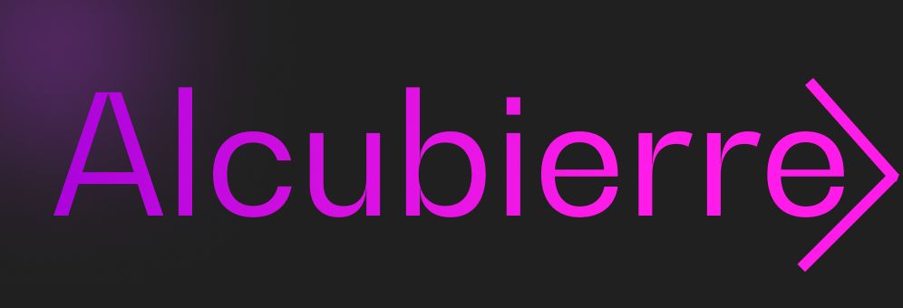

# Alcubierre
A OOP oriented game engine written in Rust. That uses wgpu under the hood to draw graphics. Rapier for physics, and Kira for audio.
Alcubierre is designed to create games *fast*. 

For things like Game Jams. 
It is no where near ready for that use case though. As what it supports is still extremely limited.

---

## What Works:
* Physics (Mostly)
* Drawing Squares
* Playing Sounds
* Scenes
* Circles (Except for the physics scaling)

---

## Coming Soon:
* Sprites
* Return GameObject from collison checks
* Camera System
* Animations
* Error Handling
* Collison Layers
* GameObject Tags
* LDTK Support
* Prefabs
* Nested GameObjects
* Music Manager
* Particle System
* Better ease of use
* Animations
* Window Resizing That doesn't break horribly
* Level Manager
* UI System with Custom Markdown Language (Mostly done just need to rewrite backend from raylib to wgpu-rs)
